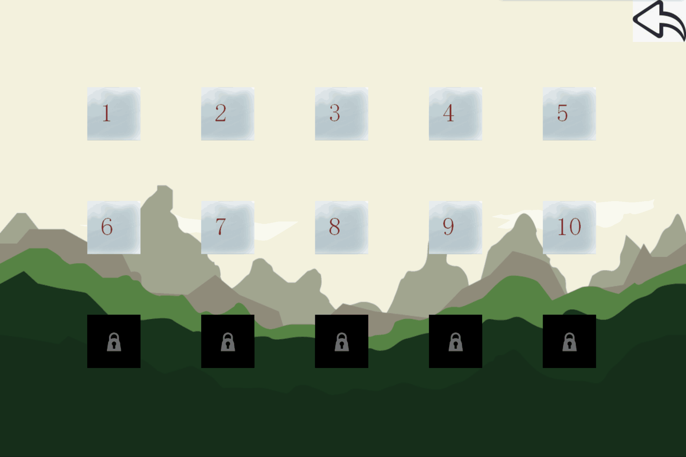
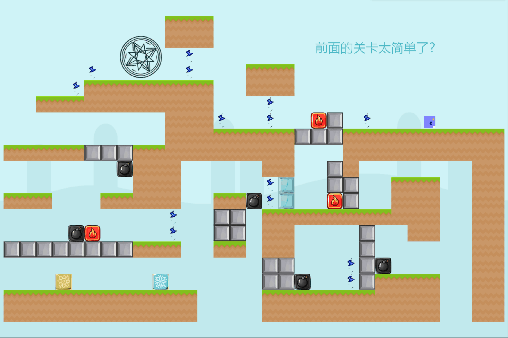
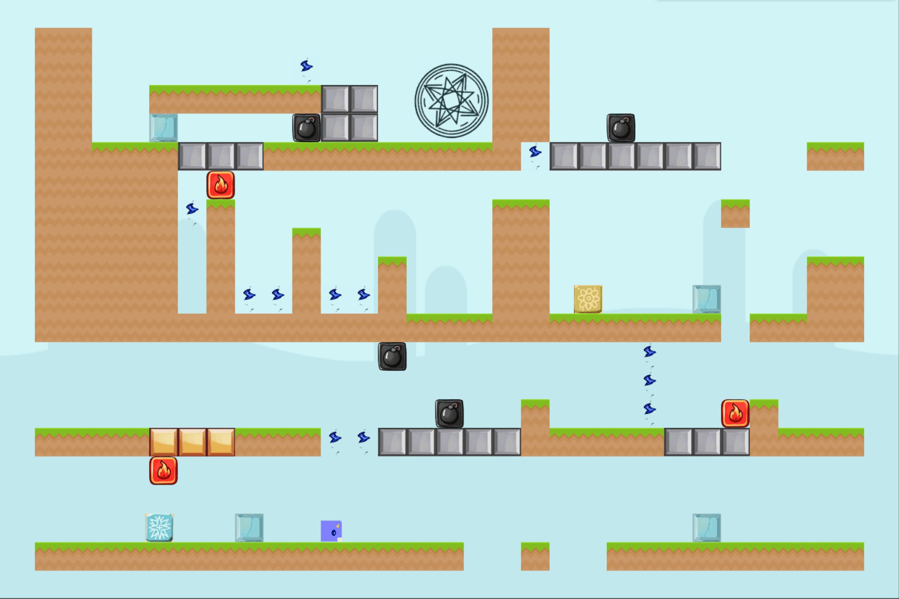

**ForDream**

这是一个基于easyx开发的2D益智闯关游戏
大一大二和同学们一起写的，当时代码不规范，没有参照标准的命名规则，供学习easyx库的同学学习交流

windows系统下可以直接运行 ForDreamSetup.msi 文件安装游戏游玩

开发环境是 Visual Studio 2022
想要在开发环境中运行项目，请先下载 easyx （[下载链接](https://easyx.cn/)）到 Visual Studio

游戏设置那里有bug，点击后有概率使程序崩溃，以后有时间会修复。

游戏内截图：

